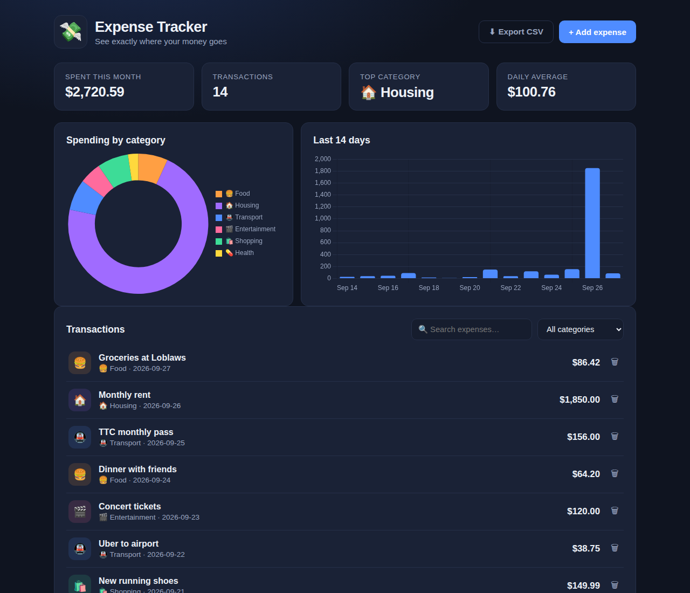
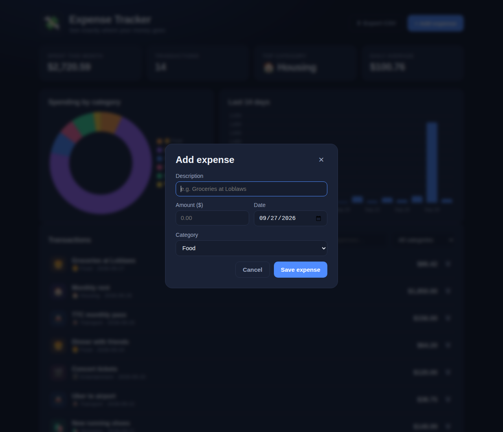

# 💸 Expense Tracker

**See exactly where your money goes — a clean, fast expense tracker with live charts, categories, and zero sign-up.**

No backend. No account. No tracking. Add an expense, watch your dashboard update instantly, and close the tab knowing your data never left your browser.



---

## ✨ Features

- **📊 Live dashboard** — monthly total, transaction count, top category, and daily average update the moment you add an expense
- **🥧 Spending charts** — doughnut breakdown by category + 14-day spending trend (Chart.js)
- **🏷️ 7 categories** — Food, Transport, Housing, Entertainment, Shopping, Health, Other, each with its own color and emoji
- **🔍 Search & filter** — find any transaction by text or category in real time
- **💾 Automatic saving** — everything persists in `localStorage`; refresh-proof
- **⬇️ CSV export** — one click downloads your data for spreadsheets
- **📱 Fully responsive** — clean layout on phone, tablet, and desktop
- **🌙 Dark fintech UI** — easy on the eyes, built with plain CSS



---

## 🏗️ Architecture

The app follows a tiny unidirectional data flow: **one state object → one render pass**. Every user action goes through a mutation function, which saves to storage and re-renders. No framework needed.

```mermaid
flowchart TB
    subgraph UI["🖥️ User Interface (index.html + style.css)"]
        FORM["➕ Expense Form\n(modal dialog)"]
        LIST["🧾 Transaction List\n(search + filter)"]
        STATS["📈 Stat Cards"]
        CHARTS["🥧 Charts\n(Chart.js doughnut + bar)"]
    end

    subgraph LOGIC["⚙️ Application Logic (app.js)"]
        MUT["Mutations\naddExpense / deleteExpense"]
        DERIVE["Derived Data\ntotalsByCategory\ncurrentMonthExpenses"]
        RENDER["render()\nstats → list → charts"]
    end

    subgraph DATA["💾 Persistence"]
        LS[("localStorage\n'expense-tracker-v1'")]
    end

    FORM -->|"submit"| MUT
    LIST -->|"delete click"| MUT
    LIST -->|"search / filter"| RENDER
    MUT -->|"save()"| LS
    LS -->|"load()"| MUT
    MUT --> RENDER
    RENDER --> DERIVE
    DERIVE --> STATS
    DERIVE --> CHARTS
    DERIVE --> LIST

    style UI fill:#1a2236,stroke:#4f8cff
    style LOGIC fill:#1a2236,stroke:#3ddc97
    style DATA fill:#1a2236,stroke:#ff9f43
```



**Why this design?**
- **Single source of truth** — `state.expenses` is the only place data lives in memory; the DOM is always derived from it, never the other way around.
- **Render is idempotent** — calling `render()` ten times produces the same screen as calling it once, which makes bugs easy to reason about.
- **Storage is a side effect, not the state** — `localStorage` is written on every mutation and read once at boot, so the app works fully offline after the first load.

---

## 🚀 Run it in 30 seconds

**Option 1 — just open it (easiest)**
1. Download or clone this repo
2. Double-click `index.html` — that's it, the app runs

**Option 2 — local server (recommended)**
```bash
# Python 3
python3 -m http.server 8000

# then open http://localhost:8000
```

> 💡 The charts load from a CDN, so you need internet on first load. Your expense data itself is 100% local.

---

## 📁 Project structure

```
expense-tracker/
├── index.html          # Page structure: header, stats, charts, list, modal
├── style.css           # Dark fintech theme (plain CSS, custom properties)
├── app.js              # All logic: state, storage, rendering, charts
├── screenshots/        # Real screenshots of the running app
│   ├── dashboard.png
│   └── add-expense.png
└── README.md
```

---

## 🛠️ Tech stack

| Layer    | Choice | Why |
|----------|--------|-----|
| Markup   | HTML5  | Semantic, accessible structure |
| Styling  | Plain CSS | Custom properties, no build step |
| Logic    | Vanilla JS | No framework — every line is readable |
| Charts   | Chart.js 4 (CDN) | Doughnut + bar with one small API |
| Storage  | localStorage | Zero backend, data stays private |

---

## 🧠 What this project practices

- **State management** — single source of truth + unidirectional render flow
- **DOM rendering** — building list UI from data with template literals
- **Event delegation** — one listener on `<ul>` handles all delete buttons
- **Data persistence** — serializing state to `localStorage` safely
- **Data visualization** — feeding aggregated data into Chart.js
- **Input validation & XSS safety** — escaping user text before injecting HTML
- **CSV generation** — building a downloadable file with `Blob`

---

## 🗺️ Roadmap

- [ ] Monthly budget goals with progress bars
- [ ] Recurring expenses (rent, subscriptions)
- [ ] Dark/light theme toggle
- [ ] Import from bank CSV exports

---

## 📄 License

MIT — use it, fork it, learn from it.
